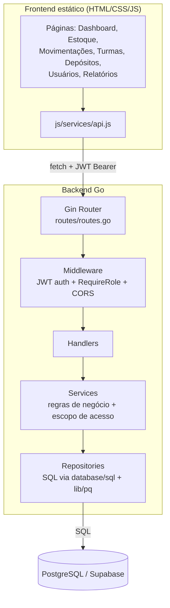

# Relatório Final — WMS (Go + Frontend Adaptado)

## 1. Arquitetura final

```
Frontend (HTML/CSS/JS puro, ES Modules)
        │  fetch() + JWT Bearer
        ▼
API Go (Gin) — cmd: main.go
        │
   routes/routes.go  ──► aplica middleware (JWT + role) em cada grupo de rota
        │
internal/handlers  ──► decodifica HTTP, chama services, traduz erro→status
        │
internal/services  ──► regras de negócio (permissões, validações, escopo)
        │
internal/repositories ──► único ponto que executa SQL
        │
   PostgreSQL (Supabase)
```

Fluxo de uma requisição típica (ex.: professor registra uma saída de estoque):

`MovementsPage (frontend)` → `API.moveStock()` → `POST /api/v1/inventory/move`
→ `middleware.RequireAuth` (valida JWT, carrega usuário) → `InventoryHandler.Move`
→ `InventoryService.MoveStock` (confirma que o professor tem acesso ao
depósito do item via `DepositService.CanAccess`) → `InventoryRepository.Move`
(transação: `UPDATE inventory` + `INSERT INTO stock_movements`) → resposta
com o item atualizado e o movimento criado.

## 2. O que foi feito no frontend

O frontend fornecido (`Front.zip`) era um SPA estático (HTML/CSS/JS puro,
sem build) já bem estruturado, mas ainda modelado em torno de "produto
isolado" (produtos, categorias, localizações, pedidos/picking) e conectado
a endpoints em português de um backend Python/FastAPI anterior.

**Arquivos removidos (vestígios de "produto isolado" e fluxos obsoletos):**
- `js/pages/products.js`, `js/pages/categories.js`, `js/pages/picking.js`
- `js/components/productModal.js`
- `js/pages/forgot-password.js` (endpoint não existe na nova API — fluxo
  quebrado removido em vez de mantido inoperante)
- Função `canRequest` (só usada pelo forgot-password removido) e
  `maskPhone` (campo de telefone removido do perfil, sem correspondência
  no backend)

**Arquivos renomeados:**
- `js/pages/school.js` → `js/pages/deposits.js` (era, na prática, o CRUD
  de depósitos; o nome "Gestão Escolar" e o campo inventado `tipo`
  escolar/didático foram removidos por não existirem na nova API)

**Arquivos novos:**
- `js/components/inventoryModal.js` — substitui `productModal.js`: modais
  de criar/editar item de estoque e de registrar entrada/saída
- `js/pages/movements.js` — tela de Entradas/Saídas com leitor de código
  de barras (era o antigo `inventory.js`)
- `js/pages/classes.js` — nova tela de Turmas (criação pela gestão,
  vínculo de professores e depósitos)

**Arquivos reescritos por completo:**
- `js/services/api.js` — cliente HTTP totalmente novo, apontando para os
  endpoints em inglês do backend Go (`/auth/*`, `/users/*`, `/deposits`,
  `/inventory`, `/inventory/move`, `/classes`), sem nenhum resquício dos
  campos em português do backend anterior (`nome`→`name`, `senha`→
  `password`, `perfil`→`role`, etc.)
- `js/pages/dashboard.js` — estatísticas e gráficos recalculados sobre
  itens de inventário e movimentações (antes eram sobre produtos,
  categorias e pedidos)
- `js/pages/reports.js`, `js/pages/exports.js` — adaptados ao novo
  histórico de movimentações; exportações de produtos/categorias/
  localizações/pedidos trocadas por depósitos/estoque/movimentações/turmas
- `js/pages/users.js` — ganhou o painel de aprovação de contas (abas
  "Pendentes"/"Ativos"), que antes não existia (contas eram ativadas na
  hora do cadastro)
- `js/pages/register.js` — não autentica mais automaticamente após o
  cadastro (a conta nasce PENDENTE); removida a seleção de turmas no
  cadastro, já que agora é a gestão quem vincula turmas depois da aprovação
- `js/pages/login.js` — passou a exibir a mensagem de erro real vinda do
  backend (ex.: "conta pendente de aprovação") em vez de um texto genérico
- `js/pages/profile.js` — usa `GET /users/me`; campo de telefone (sem
  correspondência no backend) removido; passou a exibir turmas/depósitos
  vinculados
- `js/components/sidebar.js` — navegação atualizada (Estoque,
  Entradas/Saídas, Turmas, Depósitos) e corrigido um bug real: o código
  lia `session.user.profile`, mas a API (nova e antiga) sempre retornou
  `role` — o campo simplesmente não existia e a lógica de exibição do
  perfil estava sempre caindo no valor padrão

**Consistência verificada:** todo o grafo de imports/exports do frontend
foi validado programaticamente (nenhum import quebrado ou nome inexistente
importado) após as mudanças.

## 3. Backend Go

Criado do zero em `backend/`, seguindo exatamente a estrutura pedida:

```
backend/
├── cmd/                    (reservado; main.go fica na raiz, como especificado)
├── internal/
│   ├── domain/              User, PendingUser, Deposit, InventoryItem,
│   │                        StockMovement, Class
│   ├── handlers/            tradução HTTP ↔ service (sem regra de negócio)
│   ├── services/            regras de negócio e controle de acesso
│   ├── repositories/        único ponto que executa SQL (database/sql + lib/pq)
│   ├── middleware/          RequireAuth (JWT), RequireRole, CORS
│   ├── auth/                geração/validação de JWT, hash bcrypt
│   ├── validation/          e-mail, senha (regras obrigatórias)
│   └── database/            conexão com Postgres
├── config/                  leitura do .env
├── routes/                  registro de todas as rotas
├── database/migrations/     001_init.sql (schema completo)
└── main.go
```

**Endpoints implementados** (todos sob `/api/v1`, ver `routes/routes.go`):
`POST /auth/login`, `POST /auth/register`, `GET /auth/pending` (gestão),
`POST /auth/approve` (gestão), `GET /users/me`, `GET /users` (gestão),
CRUD completo de `/deposits`, `/inventory` (+ `/inventory/move` e
`/inventory/movements`) e `/classes`.

**Regras de negócio implementadas:**
- Toda movimentação de estoque é uma transação atômica: atualiza a
  quantidade do item **e** grava o `stock_movement` de auditoria, ou
  nenhuma das duas coisas acontece.
- Nunca é permitido estoque negativo (checado antes do `UPDATE`, com a
  constraint `quantity >= 0` no banco como rede de segurança final).
- Depósito é soft-delete: desativar um depósito preserva todo o histórico
  de inventário e movimentações.
- Escopo de acesso do professor (`ClassService.AccessibleDepositIDs`) é
  resolvido inteiramente no backend: um professor só enxerga/movimenta
  depósitos vinculados às turmas às quais pertence. Isso é calculado a
  cada requisição, nunca confiado a algo enviado pelo frontend.

## 4. Segurança

- **JWT** (HS256, expira em 24h) em toda rota autenticada, validado por
  `middleware.RequireAuth` antes de qualquer handler executar.
- **bcrypt** (custo padrão) para toda senha armazenada — nunca texto puro.
- **Controle de acesso 100% no backend**: `middleware.RequireRole(gestao)`
  bloqueia rotas administrativas; `DepositService.CanAccess` e
  `ClassService.AccessibleDepositIDs` bloqueiam acesso a depósitos fora do
  escopo do professor. O frontend apenas esconde botões por UX — cada
  chamada equivalente feita diretamente à API seria recusada do mesmo jeito.
- **Validação de senha** (mínimo 8 caracteres, 1 maiúscula, 1 número, 1
  símbolo) aplicada em `internal/validation`, no cadastro. O frontend
  replica a mesma regra apenas para feedback imediato — a validação que
  vale é sempre a do servidor.
- **E-mail**: formato validado no backend; duplicidade checada tanto em
  `users` quanto em `pending_users` antes de aceitar um novo cadastro.

## 5. Sistema de contas

Fluxo pendente → aprovação → ativo, implementado literalmente com duas
tabelas (`pending_users` e `users`), conforme pedido:

1. `POST /auth/register` grava em `pending_users` com `status = 'pending'`.
   Não gera token, não ativa nada.
2. `GET /auth/pending` (gestão) lista as solicitações — consumido pela
   aba "Pendentes" de `js/pages/users.js`.
3. `POST /auth/approve` com `action: "approve"` cria a linha real em
   `users` (senha já hasheada é copiada, não re-hasheada) e marca a
   solicitação como `approved`. Com `action: "reject"`, apenas marca como
   `rejected` — nenhuma conta é criada.
4. A partir daí, `POST /auth/login` reconhece a conta normalmente.

Contas pendentes/rejeitadas nunca aparecem em `users`, então uma tentativa
de login com essas credenciais recebe a mesma mensagem genérica de
credenciais inválidas por segurança — exceto quando a conta existe mas
está com `active = false`, caso em que a mensagem é explícita ("conta
desativada").

## 6. Sistema de turmas

- `POST /classes` (gestão) cria uma turma e, opcionalmente, já define os
  professores (`teacher_ids`) e depósitos (`deposit_ids`) vinculados.
- Os vínculos vivem em duas tabelas de junção: `class_teachers` e
  `class_deposits`. `ClassRepository.SetTeachers`/`SetDeposits` substituem
  a lista inteira de forma atômica a cada edição.
- **Impacto no estoque**: `ClassService.AccessibleDepositIDs` é a função
  que traduz "turmas do professor" em "depósitos que ele pode ver/mexer".
  Ela é chamada por `DepositService` e `InventoryService` antes de
  qualquer leitura ou escrita — é o mecanismo real por trás da regra
  "professor só acessa turmas vinculadas".
- Na tela `js/pages/classes.js`, a gestão vê e edita todas as turmas; o
  professor vê apenas as suas, somente leitura.

## 7. Diagrama da arquitetura final



---

## Setup completo

Ver `backend/README.md` (backend Go) e `frontend/public/frontend/README.md`
(frontend) para os passos detalhados. Resumo:

```bash
# Backend
cd backend
cp .env.example .env   # preencher credenciais Supabase + JWT_SECRET
psql "$DATABASE_URL" -f database/migrations/001_init.sql
go mod tidy
go run main.go          # http://localhost:8000

# Frontend (em outro terminal)
cd frontend/public/frontend
python3 -m http.server 5173
# abrir http://localhost:5173
```

## Limitação conhecida deste ambiente

Este ambiente de execução não tem o compilador Go instalado nem acesso à
rede (não há como baixar módulos do `proxy.golang.org`), então **não foi
possível rodar `go build`/`go vet` para compilar o backend aqui**. Todo o
código foi escrito e revisado manualmente com bastante cuidado — tipos,
assinaturas de função entre `main.go` → `routes` → `handlers` → `services`
→ `repositories` foram conferidos um a um — mas antes de colocar em
produção, rode localmente:

```bash
cd backend
go mod tidy
go vet ./...
go build ./...
```

Se algo não compilar (bastante improvável, mas honesto dizer que não foi
testado de ponta a ponta), o erro do compilador vai apontar exatamente a
linha — o código está bem isolado por camada, então correções tendem a
ser pontuais.

No frontend, por outro lado, foi possível validar programaticamente que
**todo** import/export do projeto resolve corretamente (nenhum módulo
quebrado), o que cobre a classe de erro mais comum em um refactor deste
tamanho num projeto sem build step.
