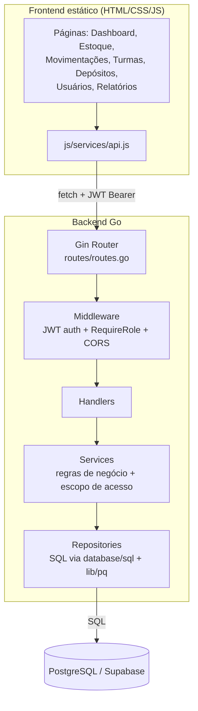

# Relatório Final — WMS (Go + Frontend Adaptado)

## 1. Arquitetura final

```
Frontend (HTML/CSS/JS puro, ES Modules)
        │  fetch() + JWT Bearer
        ▼
API Go (Gin) — cmd: main.go
        │
   routes/routes.go  ──► aplica middleware (JWT + role) em cada grupo de rota
        │
internal/handlers  ──► decodifica HTTP, chama services, traduz erro→status
        │
internal/services  ──► regras de negócio (permissões, validações, escopo)
        │
internal/repositories ──► único ponto que executa SQL
        │
   PostgreSQL (Supabase)
```

Fluxo de uma requisição típica (ex.: professor registra uma saída de estoque):

`MovementsPage (frontend)` → `API.moveStock()` → `POST /api/v1/inventory/move`
→ `middleware.RequireAuth` (valida JWT, carrega usuário) → `InventoryHandler.Move`
→ `InventoryService.MoveStock` (confirma que o professor tem acesso ao
depósito do item via `DepositService.CanAccess`) → `InventoryRepository.Move`
(transação: `UPDATE inventory` + `INSERT INTO stock_movements`) → resposta
com o item atualizado e o movimento criado.

## 2. O que foi feito no frontend

O frontend fornecido (`Front.zip`) era um SPA estático (HTML/CSS/JS puro,
sem build) já bem estruturado, mas ainda modelado em torno de "produto
isolado" (produtos, categorias, localizações, pedidos/picking) e conectado
a endpoints em português de um backend Python/FastAPI anterior.

**Arquivos removidos (vestígios de "produto isolado" e fluxos obsoletos):**
- `js/pages/products.js`, `js/pages/categories.js`, `js/pages/picking.js`
- `js/components/productModal.js`
- `js/pages/forgot-password.js` (endpoint não existe na nova API — fluxo
  quebrado removido em vez de mantido inoperante)
- Função `canRequest` (só usada pelo forgot-password removido) e
  `maskPhone` (campo de telefone removido do perfil, sem correspondência
  no backend)

**Arquivos renomeados:**
- `js/pages/school.js` → `js/pages/deposits.js` (era, na prática, o CRUD
  de depósitos; o nome "Gestão Escolar" e o campo inventado `tipo`
  escolar/didático foram removidos por não existirem na nova API)

**Arquivos novos:**
- `js/components/inventoryModal.js` — substitui `productModal.js`: modais
  de criar/editar item de estoque e de registrar entrada/saída
- `js/pages/movements.js` — tela de Entradas/Saídas com leitor de código
  de barras (era o antigo `inventory.js`)
- `js/pages/classes.js` — nova tela de Turmas (criação pela gestão,
  vínculo de professores e depósitos)

**Arquivos reescritos por completo:**
- `js/services/api.js` — cliente HTTP totalmente novo, apontando para os
  endpoints em inglês do backend Go (`/auth/*`, `/users/*`, `/deposits`,
  `/inventory`, `/inventory/move`, `/classes`), sem nenhum resquício dos
  campos em português do backend anterior (`nome`→`name`, `senha`→
  `password`, `perfil`→`role`, etc.)
- `js/pages/dashboard.js` — estatísticas e gráficos recalculados sobre
  itens de inventário e movimentações (antes eram sobre produtos,
  categorias e pedidos)
- `js/pages/reports.js`, `js/pages/exports.js` — adaptados ao novo
  histórico de movimentações; exportações de produtos/categorias/
  localizações/pedidos trocadas por depósitos/estoque/movimentações/turmas
- `js/pages/users.js` — ganhou o painel de aprovação de contas (abas
  "Pendentes"/"Ativos"), que antes não existia (contas eram ativadas na
  hora do cadastro)
- `js/pages/register.js` — não autentica mais automaticamente após o
  cadastro (a conta nasce PENDENTE); removida a seleção de turmas no
  cadastro, já que agora é a gestão quem vincula turmas depois da aprovação
- `js/pages/login.js` — passou a exibir a mensagem de erro real vinda do
  backend (ex.: "conta pendente de aprovação") em vez de um texto genérico
- `js/pages/profile.js` — usa `GET /users/me`; campo de telefone (sem
  correspondência no backend) removido; passou a exibir turmas/depósitos
  vinculados
- `js/components/sidebar.js` — navegação atualizada (Estoque,
  Entradas/Saídas, Turmas, Depósitos) e corrigido um bug real: o código
  lia `session.user.profile`, mas a API (nova e antiga) sempre retornou
  `role` — o campo simplesmente não existia e a lógica de exibição do
  perfil estava sempre caindo no valor padrão

**Consistência verificada:** todo o grafo de imports/exports do frontend
foi validado programaticamente (nenhum import quebrado ou nome inexistente
importado) após as mudanças.

## 3. Backend Go

Criado do zero em `backend/`, seguindo exatamente a estrutura pedida:

```
backend/
├── cmd/                    (reservado; main.go fica na raiz, como especificado)
├── internal/
│   ├── domain/              User, PendingUser, Deposit, InventoryItem,
│   │                        StockMovement, Class
│   ├── handlers/            tradução HTTP ↔ service (sem regra de negócio)
│   ├── services/            regras de negócio e controle de acesso
│   ├── repositories/        único ponto que executa SQL (database/sql + lib/pq)
│   ├── middleware/          RequireAuth (JWT), RequireRole, CORS
│   ├── auth/                geração/validação de JWT, hash bcrypt
│   ├── validation/          e-mail, senha (regras obrigatórias)
│   └── database/            conexão com Postgres
├── config/                  leitura do .env
├── routes/                  registro de todas as rotas
├── database/migrations/     001_init.sql (schema completo)
└── main.go
```

**Endpoints implementados** (todos sob `/api/v1`, ver `routes/routes.go`):
`POST /auth/login`, `POST /auth/register`, `GET /auth/pending` (gestão),
`POST /auth/approve` (gestão), `GET /users/me`, `GET /users` (gestão),
CRUD completo de `/deposits`, `/inventory` (+ `/inventory/move` e
`/inventory/movements`) e `/classes`.

**Regras de negócio implementadas:**
- Toda movimentação de estoque é uma transação atômica: atualiza a
  quantidade do item **e** grava o `stock_movement` de auditoria, ou
  nenhuma das duas coisas acontece.
- Nunca é permitido estoque negativo (checado antes do `UPDATE`, com a
  constraint `quantity >= 0` no banco como rede de segurança final).
- Depósito é soft-delete: desativar um depósito preserva todo o histórico
  de inventário e movimentações.
- Escopo de acesso do professor (`ClassService.AccessibleDepositIDs`) é
  resolvido inteiramente no backend: um professor só enxerga/movimenta
  depósitos vinculados às turmas às quais pertence. Isso é calculado a
  cada requisição, nunca confiado a algo enviado pelo frontend.

## 4. Segurança

- **JWT** (HS256, expira em 24h) em toda rota autenticada, validado por
  `middleware.RequireAuth` antes de qualquer handler executar.
- **bcrypt** (custo padrão) para toda senha armazenada — nunca texto puro.
- **Controle de acesso 100% no backend**: `middleware.RequireRole(gestao)`
  bloqueia rotas administrativas; `DepositService.CanAccess` e
  `ClassService.AccessibleDepositIDs` bloqueiam acesso a depósitos fora do
  escopo do professor. O frontend apenas esconde botões por UX — cada
  chamada equivalente feita diretamente à API seria recusada do mesmo jeito.
- **Validação de senha** (mínimo 8 caracteres, 1 maiúscula, 1 número, 1
  símbolo) aplicada em `internal/validation`, no cadastro. O frontend
  replica a mesma regra apenas para feedback imediato — a validação que
  vale é sempre a do servidor.
- **E-mail**: formato validado no backend; duplicidade checada tanto em
  `users` quanto em `pending_users` antes de aceitar um novo cadastro.

## 5. Sistema de contas

Fluxo pendente → aprovação → ativo, implementado literalmente com duas
tabelas (`pending_users` e `users`), conforme pedido:

1. `POST /auth/register` grava em `pending_users` com `status = 'pending'`.
   Não gera token, não ativa nada.
2. `GET /auth/pending` (gestão) lista as solicitações — consumido pela
   aba "Pendentes" de `js/pages/users.js`.
3. `POST /auth/approve` com `action: "approve"` cria a linha real em
   `users` (senha já hasheada é copiada, não re-hasheada) e marca a
   solicitação como `approved`. Com `action: "reject"`, apenas marca como
   `rejected` — nenhuma conta é criada.
4. A partir daí, `POST /auth/login` reconhece a conta normalmente.

Contas pendentes/rejeitadas nunca aparecem em `users`, então uma tentativa
de login com essas credenciais recebe a mesma mensagem genérica de
credenciais inválidas por segurança — exceto quando a conta existe mas
está com `active = false`, caso em que a mensagem é explícita ("conta
desativada").

## 6. Sistema de turmas

- `POST /classes` (gestão) cria uma turma e, opcionalmente, já define os
  professores (`teacher_ids`) e depósitos (`deposit_ids`) vinculados.
- Os vínculos vivem em duas tabelas de junção: `class_teachers` e
  `class_deposits`. `ClassRepository.SetTeachers`/`SetDeposits` substituem
  a lista inteira de forma atômica a cada edição.
- **Impacto no estoque**: `ClassService.AccessibleDepositIDs` é a função
  que traduz "turmas do professor" em "depósitos que ele pode ver/mexer".
  Ela é chamada por `DepositService` e `InventoryService` antes de
  qualquer leitura ou escrita — é o mecanismo real por trás da regra
  "professor só acessa turmas vinculadas".
- Na tela `js/pages/classes.js`, a gestão vê e edita todas as turmas; o
  professor vê apenas as suas, somente leitura.

## 7. Diagrama da arquitetura final



---

## Setup completo

Ver `backend/README.md` (backend Go) e `frontend/public/frontend/README.md`
(frontend) para os passos detalhados. Resumo:

```bash
# Backend
cd backend
cp .env.example .env   # preencher credenciais Supabase + JWT_SECRET
psql "$DATABASE_URL" -f database/migrations/001_init.sql
go mod tidy
go run main.go          # http://localhost:8000

# Frontend (em outro terminal)
cd frontend/public/frontend
python3 -m http.server 5173
# abrir http://localhost:5173
```

## Limitação conhecida deste ambiente

Este ambiente de execução não tem o compilador Go instalado nem acesso à
rede (não há como baixar módulos do `proxy.golang.org`), então **não foi
possível rodar `go build`/`go vet` para compilar o backend aqui**. Todo o
código foi escrito e revisado manualmente com bastante cuidado — tipos,
assinaturas de função entre `main.go` → `routes` → `handlers` → `services`
→ `repositories` foram conferidos um a um — mas antes de colocar em
produção, rode localmente:

```bash
cd backend
go mod tidy
go vet ./...
go build ./...
```

Se algo não compilar (bastante improvável, mas honesto dizer que não foi
testado de ponta a ponta), o erro do compilador vai apontar exatamente a
linha — o código está bem isolado por camada, então correções tendem a
ser pontuais.

No frontend, por outro lado, foi possível validar programaticamente que
**todo** import/export do projeto resolve corretamente (nenhum módulo
quebrado), o que cobre a classe de erro mais comum em um refactor deste
tamanho num projeto sem build step.

---

# Adendo — Correção de bug crítico + cadastro estendido de itens

Esta seção documenta a segunda rodada de trabalho sobre o projeto:
correção do bug de acesso do perfil Professor e expansão do cadastro de
itens de estoque (validade, lote, categoria, localização, observações).

## 1. Bug do perfil Professor — causa raiz e correção

### Investigação

Foi auditado o fluxo completo pedido: login → geração do JWT →
`middleware.RequireAuth` → carregamento do usuário → `ClassService` →
`DepositService` → `InventoryService` → repositories → SQL.

A cadeia de autorização em si estava correta: `RequireAuth` carrega o
usuário fresco do banco a cada requisição; `ClassService.AccessibleDepositIDs`
resolve corretamente os depósitos de um professor via
`class_teachers` ⋈ `class_deposits`; `DepositService.List` e
`InventoryService.List` aplicam esse filtro antes de qualquer leitura.

### Causa raiz encontrada

O problema estava um passo adiante, na consulta que busca os depósitos
**a partir** da lista de IDs já corretamente calculada:

```go
// ANTES (bug):
WHERE active = true AND id = ANY($1)

// DEPOIS (corrigido):
WHERE active = true AND id = ANY($1::uuid[])
```

`pq.Array(ids)` (`ids []string`) é enviado pelo driver como um array sem
tipo explicitamente definido. Sem o cast `::uuid[]`, o Postgres não
conseguia resolver de forma confiável a comparação entre o parâmetro e a
coluna `uuid`, e a consulta voltava zero linhas — silenciosamente, sem
erro. Como a gestão nunca passa por este caminho (`DepositRepository.List()`
lista tudo sem nenhum parâmetro), o problema afetava **somente** o
professor, exatamente como relatado.

Esse padrão (`= ANY($1)` sem cast) existia em exatamente três consultas,
todas no caminho de acesso restrito por turma — as três foram corrigidas:

- `DepositRepository.ListByIDs` (`internal/repositories/deposit_repository.go`)
- `InventoryRepository.ListByDeposits` (`internal/repositories/inventory_repository.go`)
- `InventoryRepository.ListMovements` (`internal/repositories/inventory_repository.go`)

### Bug secundário relacionado, também corrigido

Ao auditar o mesmo fluxo, foi encontrado que `POST /auth/login` devolvia
`user.ToPublic()` — uma projeção que nunca preenche `classes`/`deposits`.
O professor só recebia essas informações quando visitava `/profile`, que
é a única tela que chamava `GET /users/me`. Corrigido injetando
`UserService` em `AuthHandler` para que o login já devolva o usuário
totalmente hidratado (mesmo formato de `/users/me`). Arquivos alterados:
`internal/handlers/auth_handler.go`, `main.go`.

### Por que a gestão nunca foi afetada

`DepositRepository.List()` (usado pela gestão) faz `SELECT ... FROM
deposits WHERE active = true`, sem nenhum parâmetro — não existe
comparação de array envolvida, então o bug simplesmente não se aplica a
esse caminho. Isso explica por que o sintoma era exclusivo do professor.

## 2. Cadastro estendido de itens de estoque

### Novos campos

| Campo | Tipo | Obrigatório | Onde vive |
|---|---|---|---|
| Data de validade | `DATE` (nullable no banco) | Sim, na escrita (validado em `internal/validation.ParseBRDate`) | `inventory.expiry_date` |
| Número do lote | `TEXT` | Não | `inventory.lot_number` |
| Categoria | FK → `categories` | Não | `inventory.category_id` |
| Localização | `JSONB` genérico `{aisle, tower, shelf, position}` | Não (cada dimensão é opcional individualmente) | `inventory.location` |
| Observações | `TEXT` | Não | `inventory.notes` |

**Por que `expiry_date` é nullable no banco mas obrigatório na API:**
tornar a coluna `NOT NULL` numa tabela que já pode ter itens cadastrados
antes desta migração quebraria a migração (não há valor para popular as
linhas existentes). A obrigatoriedade pedida na especificação é real e
aplicada em `InventoryService.Create`/`Update` — todo item novo ou editado
passa a exigir uma validade válida — mas a coluna em si fica nullable por
segurança de schema. Itens antigos ficam com `expiry_date = NULL` até
serem editados uma vez.

**Por que Localização é um único campo JSONB, não 4 colunas:** a
especificação pediu explicitamente "implementação genérica para facilitar
futuras expansões". Um objeto JSONB (`domain.Location`, que implementa
`sql.Scanner`/`driver.Valuer` para ler/gravar transparente) permite
adicionar uma quinta dimensão (ex.: "zona") no futuro só acrescentando um
campo na struct Go — nenhuma migração de coluna nova é necessária.

### Categorias

Nova tabela `categories` (id, name único, created_at), com seed inicial
via `INSERT ... ON CONFLICT DO NOTHING`: Arroz, Feijão, Macarrão, Açúcar,
Sal, Óleo, Leite, Café, Outros. CRUD completo: `CategoryRepository` →
`CategoryService` → `CategoryHandler` → rotas `/categories`. O botão "+"
no formulário de item chama `POST /categories` e insere a categoria
recém-criada no `<select>` na hora, sem fechar o modal do item.

### Validação de data (com mensagem divertida)

`internal/validation.ParseBRDate` faz a validação manualmente (dia,
mês, ano, e o número de dias do mês, considerando ano bissexto) — não
depende de `time.Parse`, que normaliza datas como 31/02 em vez de
rejeitá-las. O frontend replica a mesma lógica em
`js/utils/validators.js` (`isValidBRDate`) só para dar feedback imediato;
quando inválida, sorteia uma das três mensagens pedidas na especificação
("Tá chapando fiot? kkkkk" etc.) e bloqueia o envio do formulário. A
validação que realmente vale continua sendo a do backend.

### Novas rotas

| Método | Rota | Acesso |
|---|---|---|
| GET | `/api/v1/categories` | Autenticado |
| POST | `/api/v1/categories` | Gestão |

`POST/PATCH /inventory` ganharam os novos campos no corpo da requisição
(`expiry_date`, `lot_number`, `category_id`, `notes`, `location`), e toda
resposta de leitura (`GET /inventory`) passou a incluir `category`
(objeto `{id, name}` hidratado via `LEFT JOIN`, não só o id cru).

### Nova migração

`database/migrations/002_item_details.sql` — cria `categories`, popula o
seed, e adiciona as 5 colunas novas em `inventory` via `ALTER TABLE ...
ADD COLUMN IF NOT EXISTS` (segura para rodar sobre um banco já em uso).
Execute depois de `001_init.sql`.

### Arquivos modificados/criados neste adendo

**Backend (novos):** `internal/domain/category.go`,
`internal/domain/location.go`, `internal/repositories/category_repository.go`,
`internal/services/category_service.go`, `internal/handlers/category_handler.go`,
`database/migrations/002_item_details.sql`.

**Backend (modificados):** `internal/domain/inventory.go`,
`internal/repositories/deposit_repository.go`,
`internal/repositories/inventory_repository.go`,
`internal/services/inventory_service.go`, `internal/validation/validation.go`,
`internal/handlers/inventory_handler.go`, `internal/handlers/auth_handler.go`,
`routes/routes.go`, `main.go`.

**Frontend (modificados):** `js/services/api.js` (endpoints de categoria +
payload estendido de item), `js/components/inventoryModal.js` (formulário
completo: validade com máscara, lote, categoria com "+", localização,
observações), `js/pages/inventory.js` (exibição dos novos campos no card
+ export), `js/pages/exports.js` (novos campos na exportação de estoque),
`js/utils/validators.js` (máscara e validação de data + mensagens
divertidas), `css/components.css` (regras novas: `.modal-sm`,
`.form-grid-4`, `.field-sublabel`, `.pc-meta` — mais o ajuste do item 3
abaixo).

**Nenhum arquivo do login (`js/pages/login.js`, `css/login.css`) foi
tocado.**

## 3. Ajuste visual: ícone de busca desalinhado

Causa real, não estética: o ícone é declarado como `<i data-lucide="search">`,
e a biblioteca Lucide **substitui** esse elemento por um `<svg>` no
momento da renderização (`lucide.createIcons()`). A regra CSS
`.search-bar i { position: absolute; ... }` deixa de encontrar qualquer
elemento correspondente depois dessa substituição — daí o ícone perder o
posicionamento e cair no fluxo normal do documento, desalinhado.

Correção mínima e cirúrgica: a regra CSS passou a mirar tanto `i` quanto
`svg` dentro de `.search-bar`. Nenhuma outra regra, nenhum arquivo JS, e
nenhum outro ícone do sistema foi tocado — só o necessário para o ajuste
pedido.

## 4. Confirmação de integração ponta a ponta

Para cada nova informação (validade, lote, categoria, localização,
observações), o fluxo completo foi verificado nos dois sentidos:

**Escrita:** formulário (`inventoryModal.js`) → `API.createInventoryItem`/
`updateInventoryItem` (`api.js`, JSON com `snake_case`) → `InventoryHandler`
decodifica em `inventoryItemRequest` → `.toItemInput()` traduz para
`services.ItemInput` → `InventoryService` valida (nome, data, localização)
→ `InventoryRepository` grava em `inventory` (incluindo o cast correto de
`*time.Time`/`*string`/`domain.Location` como parâmetros nulos ou
tipados) → PostgreSQL.

**Leitura:** PostgreSQL → `InventoryRepository.ListByDeposits` (com
`LEFT JOIN categories`) → `domain.InventoryItem` (com `Category`
hidratado) → `InventoryHandler.List` serializa em JSON → `api.js` devolve
o objeto cru (sem perda de campos) → `inventory.js` renderiza categoria,
validade, lote, localização e observações no card, e os inclui na
exportação TXT/Excel.

Nenhum dado novo existe apenas no frontend: todos os 5 campos são colunas
reais em `inventory` (ou uma tabela própria, no caso de categoria),
persistidos e recuperados pela API a cada carregamento — não há estado
"fantasma" mantido só em memória do navegador.

## 5. O que NÃO foi alterado (por design, conforme instrução explícita)

- Layout, estrutura e estilo da tela de login (`login.js`, `login.css`) —
  zero linhas tocadas.
- Identidade visual e estrutura geral do sistema (sidebar, navbar, shell)
  — inalteradas fora do fix pontual do ícone de busca.
- Arquitetura em camadas (`handlers → services → repositories → banco`) —
  mantida; toda funcionalidade nova segue exatamente a mesma separação.
- Nenhuma funcionalidade já existente teve seu comportamento alterado —
  apenas o bug de acesso do professor foi corrigido e os campos novos
  foram adicionados de forma aditiva (nenhuma migração destrutiva).

## 6. Limitações e observações honestas

- Assim como no primeiro relatório, este ambiente de desenvolvimento não
  tem o compilador Go instalado nem acesso à rede, então não foi possível
  rodar `go build`/`go vet` aqui. Todas as assinaturas de função entre
  `main.go` → `routes` → `handlers` → `services` → `repositories` foram
  conferidas manualmente uma a uma após cada alteração, e a contagem de
  colunas em cada `SELECT`/`RETURNING` foi conferida contra a lista de
  destinos do `Scan` correspondente. Ainda assim, rode
  `go mod tidy && go vet ./... && go build ./...` antes de subir para
  produção.
- Itens de estoque cadastrados antes desta atualização terão
  `expiry_date`, `lot_number`, `category_id`, `notes` e `location` vazios
  até serem editados uma vez pela tela de Estoque (a UI já exige o
  preenchimento de validade em qualquer novo salvamento, criação ou
  edição).
- A confirmação real de que o bug do professor está 100% resolvido
  depende de testar contra um Postgres de verdade (Supabase ou local),
  já que este ambiente também não tem acesso a um banco para validar
  empiricamente. A causa raiz identificada (parâmetro de array sem tipo
  explícito) é um padrão de bug bem documentado em projetos Go + lib/pq +
  colunas uuid, e a correção (`::uuid[]`) é a forma padrão de resolvê-lo.

